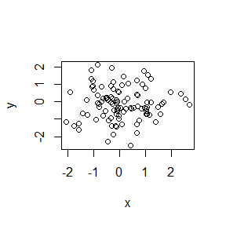

cm004
================

This is a line of text

-   bullet 1
-   bullet 2

``` r
x <- rnorm(100)
y <- rnorm(100)
plot(x, y)
```



``` r
summary(x)
```

    ##     Min.  1st Qu.   Median     Mean  3rd Qu.     Max. 
    ## -2.14993 -0.58541 -0.05213  0.02002  0.60583  2.22496
