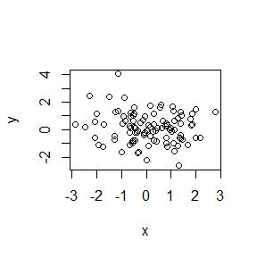

# cm004

# this is a level 1 header

## This is my header random editttt


This is a line of text

- bullet 1
- bullet 2


```r
x <- rnorm(100)
y <- rnorm(100)
plot(x, y)
```

<!-- -->


```r
summary(x)
```

```
##    Min. 1st Qu.  Median    Mean 3rd Qu.    Max. 
## -2.0746 -0.5727  0.2080  0.1582  0.8552  2.9806
```


